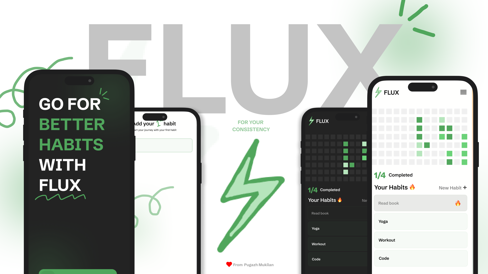
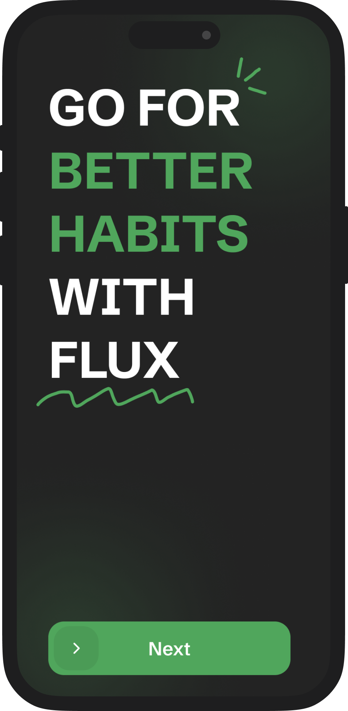

<p align="center">
  
</p>

<h1 align="center">FLUX - Habit Tracker</h1>

<p align="center">
  
</p>

<p align="center">
  A minimalist and beautiful habit tracking application built with Flutter to help you build and maintain positive habits.
</p>

<p align="center">
  
  
  
  
</p>

---

## 🌟 About The Project

FLUX isn't just another habit tracker; it's a visual journey of your commitment. Built with a clean, minimalist aesthetic, FLUX helps you focus on what truly matters: building consistent, positive habits. With a satisfying GitHub-style heatmap, you can watch your progress grow day by day, turning small efforts into a powerful streak of success.

Whether you prefer a bright, clean interface or a sleek dark mode, FLUX adapts to your style. Every interaction is designed to be simple and intuitive, from adding a new habit to marking it complete with a single tap. Stop managing lists and start building a better you, one day at a time.

## ✨ Features

- **Track Daily Habits**: Easily add, complete, and delete your daily habits.
- **Contribution Heatmap**: Visualize your consistency and streaks with a GitHub-style heatmap.
- **Light & Dark Mode**: Seamlessly switch between light and dark themes to suit your preference.
- **Persistent Storage**: Your habits are saved locally on your device using the high-performance **Hive** database.
- **Clean & Minimalist UI**: A beautiful, clutter-free interface that keeps you focused on your goals.

## 📸 Screenshots

<table align="center">
  <tr>
    <td align="center"><strong>Welcome Page (Light)</strong></td>
    <td align="center"><strong>Welcome Page (Dark)</strong></td>
  </tr>
  <tr>
    <td></td>
    <td></td>
  </tr>
  <tr>
    <td align="center"><strong>Home Page (Light)</strong></td>
    <td align="center"><strong>Home Page (Dark)</strong></td>
  </tr>
  <tr>
    <td></td>
    <td></td>
  </tr>
  <tr>
    <td align="center"><strong>First Habit (Light)</strong></td>
    <td align="center"><strong>First Habit (Dark)</strong></td>
  </tr>
  <tr>
    <td></td>
    <td></td>
  </tr>
</table>

## 🛠️ Built With

- **[Flutter](https://flutter.dev/)** - The UI toolkit for building beautiful, natively compiled applications for mobile, web, and desktop from a single codebase.
- **[Dart](https://dart.dev/)** - The programming language used by Flutter.
- **[BLoC](https://bloclibrary.dev/)** - A predictable state management library for Dart that helps implement the BLoC design pattern.
- **[Hive](https://pub.dev/packages/hive)** - A lightweight and blazing fast key-value database written in pure Dart.

## 🏗️ How It Works: A Developer's Perspective

This app follows a clean architecture pattern, separating business logic from the UI layer.

### 1. State Management (BLoC)

The core of the app's logic is managed by two BLoCs:

-   **`ThemeBloc`**: Handles toggling between light and dark modes. It listens for a `ToggleTheme` event and emits a new `ThemeState` (`ThemeLight` or `ThemeDark`), which the UI uses to rebuild the `MaterialApp` with the correct theme.

-   **`HabitBloc`**: Manages all logic related to habits and the heatmap.
    -   **Events**: The UI dispatches events like `GetHabit`, `AddHabit`, `ToggleHabit`, and `DeleteHabit`.
    -   **State**: The BLoC processes these events, interacts with the Hive database, and emits a single, unified state: `HabitLoaded`. This state contains all the data the UI needs:
        -   `Map<String, Habit> habits`: The list of all habits.
        -   `List<ContributionEntry> heatmapEntries`: The dataset for the heatmap visualization.
    -   **UI Reaction**: The `home.dart` screen uses a single `BlocBuilder` that listens for the `HabitLoaded` state. When a new state is emitted, the entire UI (both the heatmap and the habit list) rebuilds with the new data, ensuring consistency.

### 2. Data Persistence (Hive)

Instead of in-memory storage, the app uses **Hive** for fast and reliable local persistence.

-   **Boxes**: The database is organized into "boxes" (similar to tables):
    -   `habits`: A box that stores `Habit` objects. The **key** is the habit name (a `String`), and the **value** is the `Habit` object itself.
    -   `heatmap`: A box that stores the contribution count for each day. The **key** is a date formatted as a `String` (`'yyyy-MM-dd'`), and the **value** is an `int`.
    -   `settings`: A general-purpose box for other data.

-   **TypeAdapters**: The `Habit` model is annotated with `@HiveType` and `@HiveField`. A `TypeAdapter` (`habit.g.dart`) is generated by `build_runner`, which allows Hive to store and retrieve native `Habit` objects directly without manual JSON serialization.

### 3. UI Layer

-   **`home.dart`**: This is the main screen of the application. It is a `StatefulWidget` that dispatches the initial `GetHabit` event in `initState`.
-   **`BlocBuilder`**: The entire body of the `Scaffold` is wrapped in a `BlocBuilder<HabitBloc, HabitState>`. This ensures that whenever the `HabitBloc` emits a new state, the UI efficiently rebuilds only the necessary parts with the latest data from the `HabitLoaded` state.
-   **Events on UI Interaction**: User actions, like tapping a checkbox or adding a new habit, trigger `onTap` or `onPressed` callbacks that dispatch the corresponding events to the `HabitBloc`, completing the event-state loop.

## 🚀 Getting Started

To get a local copy up and running, follow these simple steps.

### Prerequisites

- You must have the Flutter SDK installed on your machine. For instructions, see the [official Flutter documentation](https://flutter.dev/docs/get-started/install).

### Installation

1.  **Clone the repository:**
    ```sh
    git clone https://github.com/pugazhmukilan/FLUX-HabitStreakFlutterApp.git
    ```
2.  **Navigate to the project directory:**
    ```sh
    cd FLUX-HabitStreakFlutterApp
    ```
3.  **Install dependencies:**
    ```sh
    flutter pub get
    ```
4.  **Run the Hive code generator:**
    This step is necessary to generate the adapter for your `Habit` model.
    ```sh
    dart run build_runner build --delete-conflicting-outputs
    ```
5.  **Run the app:**
    ```sh
    flutter run
    ```

## 📄 License

Distributed under the MIT License. See `LICENSE` for more information.

---

<p align="center">
  Made with ❤️ by pugazhmukilan
</p>
